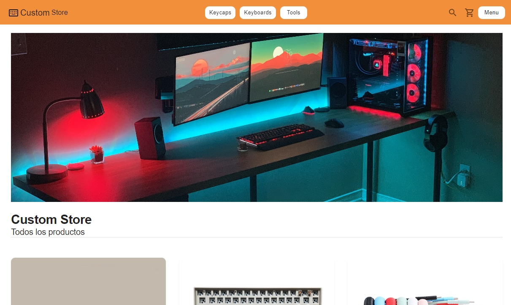
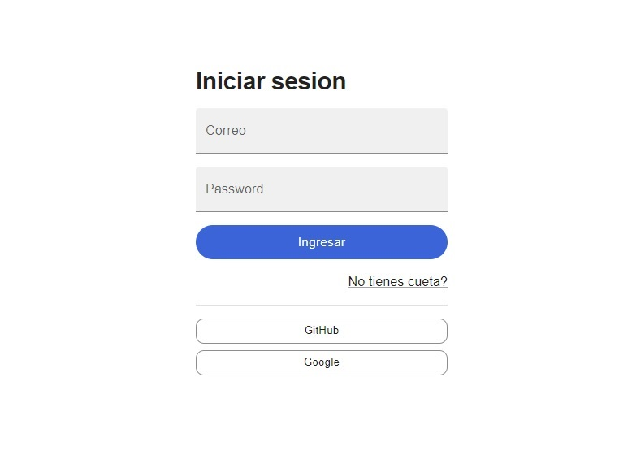
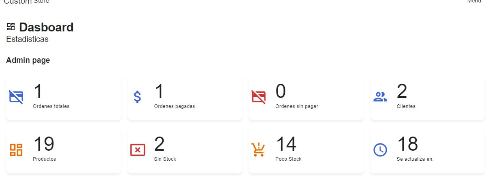
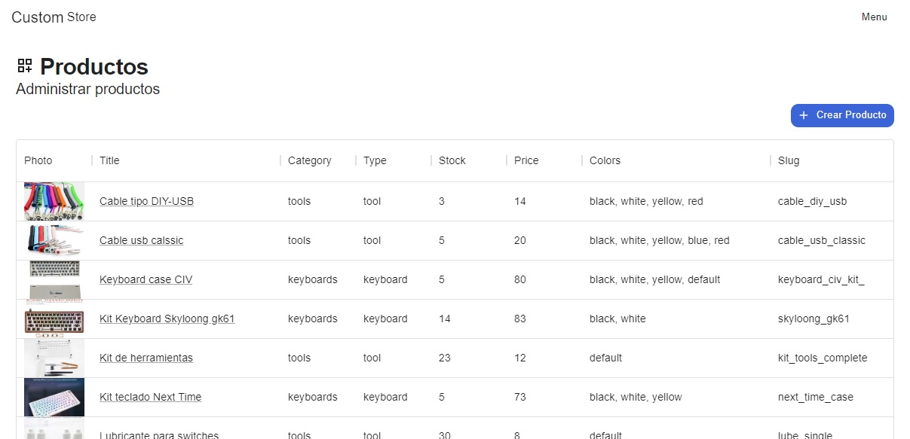
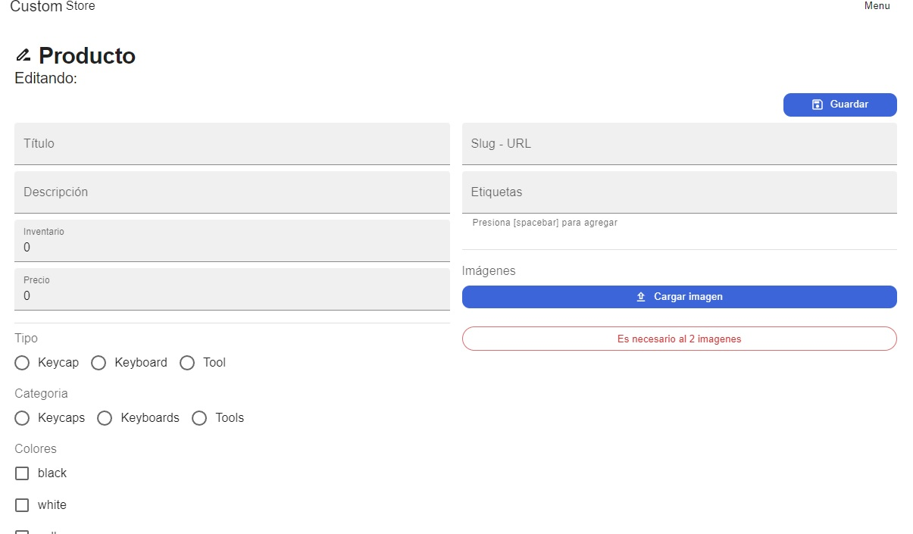

### Custom shop

Es una ecommerce desarrollada en nextjs, usando typescript, mongodb altas para la base de datos. Se puede crear usuarios que seran guardados en la base de datos y manteniendo la sesion por uso de cookies, el usurio puede agregar productos al carrito, procesar una simulacion de compra con paypal y ver su historial de compra.



## Login o Registo
Se puede usar github o google:



## Seccion de administrador

Cuando estas como administrador, puedes ver toda la lista de productos, agregar, borrar y cambiar roles de usuarios.








# Para desarrollar se uso:

- Nextjs
- Typescript
- Mongodb Atlas
- Material Ui
- Auth Next
- React-hook-form
- Cookies js
- JWT
- encrypt js
- docker


# Next.js CustomShop App
Para correr localmente, se necesita la base de datos

```
docker-compose up -d

```

* El -d, siginifica __detached__


## Configurar las variables de entorno
Renombrar el archivo __.env.template__a__.env__
* MongoDB URL Local:
```
MONGO_URL=MONGO://localhost:27017/productsdb
```

* Reconstruir los modulos de node y levantar Next

```
yarn install
yarn dev

```


## Llenar la base de datos con informacion de pruebas (crea el modelo)

Llamara:
```
https://localhost:3000/api/seed